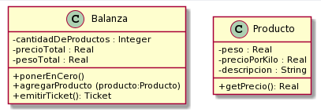
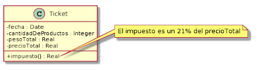

# Objetivo

Nuestros modelos de objetos se ponen un poquito mas interesantes. En esta actividad implementamos tres clases. Instancias de algunas de esas clases envían mensajes a instancias de otras y hacen cálculos. Instancias de una de esas clases crean instancias de otra utilizando un constructor con parámetros. En alguno de los métodos a implementar se recibe un objeto (una referencia a una instancia de una clase) como parámetro y se le envían mensajes. Por ahora no tenemos relaciones entre objetos (entre instancias de nuestras clases); lo mas raro que vemos por ahora es que un Ticket tiene en una de sus variables de instancia una referencia a una instancia de la clase LocalDate. 

Practicamos: definiciones de clases, metodos que reciben objetos como parámetros, constructores con parámetros, envios de mensajes entre objetos.

# Balanza electrónica

En el taller de programación programaste una balanza electrónica. Vamos a programarla de nuevo, pero con algún requerimiento adicional. 

En términos generales, la Balanza electrónica recibe productos (uno a uno), y calcula dos totales: peso total y precio total. Además, la balanza puede poner en cero todos sus valores. Cuando se lo indicamos emite un ticket que puede responder con el número de productos considerados, peso total, precio total y la fecha de emisión. La balanza no guarda los productos. 

En el paquete oo1.balanza, programá las clases que se muestran a continuación. 

Fijate que no se documentan en el diagrama los mensajes que nos permiten obtener y establecer los atributos de los objetos (accessors). Aunque no los incluimos, los tests fallan si no los implementamos. Consultá con el ayudante para identificar, a partir de los tests que fallan, cuales son los accessors necesarios (pista: todos menos los setters de balanza). 

Todas las clases son subclases de Object.

Nota: Para las fechas, vamos a utilizar la clase java.time.LocalDate. Para crear la fecha actual, podemos utilizar LocalDate.now(). También es posible crear fechas distintas a la actual. Si te interesa, podés investigar más sobre esta clase en https://docs.oracle.com/javase/8/docs/api/java/time/LocalDate.html

En la carpeta src/test/java dejamos (en el mismo paquete que las clases que vas a implementar) dos clases de prueba. Una para la balanza y otra para el producto. Si todo salió bien, tu implementación debería pasar las pruebas que definen esas clases test. El propósito de estas clases es ejercitar una instancia de la clase Balanza y una de la clase Producto y verificar que se comportan correctamente. 

# Prestar atención 

Los tipos de las propiedades en los diagramas no coinciden con los que tenemos en Java (ya veremos por qué). Cuando dice Real, podés utilizar double; cuando dice Ingener podés usar int; cuando dice Date, podés usar java.time.LocalDate .

# Para pensar

Si mirás la clase ProductoTest vas a notar que asume que existe un constructor sin parametros para crear un producto. Para implementar un constructor sin parametros que inicialice buen a un objeto necesitamos asumir que valores tomarán sus variables al comenzar. Asumir que el peso y precioPorKilo son 0 puede sonar lógico, pero ¿qué valor podemos asumir para la descripción? Sería mejor tener un constructor que reciba la descripción como parámetro, ¿te animás a escribirlo y a actualizar el test para que lo use?

En estos primeros ejercicios, los tests prueban cosas que más adelante vamos a decidir no testear (como los getters, setters, y constructores simples). A futuro solo testearemos aquello que puede fallar. Dicho eso, no vemos que haya una clase TicketTest que pruebe el método impuesto() de la clase Ticket que tuviste que programar; ¿te animás a escribirla inspirandote en las otras? (no te preocupes si se complica, ya lo vamos a ver en detalle)
