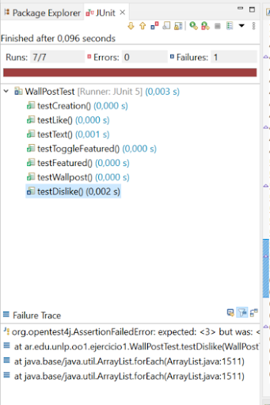
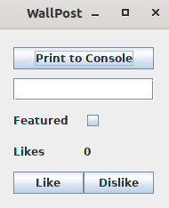

# Primera parte

Se está construyendo una red social como Facebook o Twitter. Debemos definir una clase Wallpost con los siguientes atributos: un texto que se desea publicar, cantidad de likes (“me gusta”) y una marca que indica si es destacado o no. La clase Wallpost es subclase de Object.

En la carpeta "base" una implementación a medio terminar que usted. Allí encontrará la interface Wallpost y la clase WallpostImpl que implementa la interfaz anterior.

Usted debe completar la clase WallPostImpl para ofrecer la siguiente funcionalidad:

```Java
/*
* Permite construir una instancia del WallpostImpl.
* Luego de la invocación, debe tener como texto: “Undefined post”,
* no debe estar marcado como destacado y la cantidad de “Me gusta” debe ser 0.
*/
public WallPostImpl()

/*
* Retorna el texto descriptivo de la publicación
*/
public String getText() 

/*
* Asigna el texto descriptivo de la publicación
*/
public void setText (String descriptionText)

/*
* Retorna la cantidad de “me gusta”
*/
public int getLikes() 

/*
 * Incrementa la cantidad de likes en uno.
*/
public void like() 

/*
 * Decrementa la cantidad de likes en uno. Si ya es 0, no hace nada.
*/
public void dislike()

/*
 * Retorna true si el post está marcado como destacado, false en caso contrario
*/
public boolean isFeatured() 

/*
 * Cambia el post del estado destacado a no destacado y viceversa.
*/
public void toggleFeatured()

```
 
# Segunda parte

Utilice los tests provistos por la cátedra para comprobar que su implementación de Wallpost es correcta. Estos se encuentran en el mismo proyecto, en la carpeta test, clase WallPostTest.

Para ejecutar los tests simplemente haga click derecho sobre el proyecto y utilice la opción Run As >> JUnit Test. Al ejecutarlo, se abrirá una ventana con el resultado de la evaluación de los tests. Siéntase libre de investigar la implementación de la clase de test. Ya veremos en detalle cómo implementarlas. 

En el informe, Runs indica la cantidad de test que se ejecutaron. En Errors se indica la cantidad que dieron error y en Failures se indica la cantidad que tuvieron alguna falla, es decir,  los resultados no son los esperados. Abajo, se muestra el Failure Trace del test que falló. Si lo selecciona, mostrará el mensaje de error correspondiente a ese test, que le ayudará a encontrar la falla. Si hace click sobre alguno de los test, se abrirá su implementación en el editor. 



# Tercera parte

Una vez que su implementación pasa los tests de la primera parte puede utilizar la ventana que se muestra a continuación, la cual permite inspeccionar y manipular el post (definir su texto, hacer like / dislike y marcarlo como destacado).



Para visualizar la ventana, sobre el proyecto, usar la opción del menú contextual Run As >> Java Application. La ventana permite cambiar el texto del post, incrementar la cantidad de likes, etc. El botón Print to Console imprimirá los datos del post en la consola. 
